# le_uplift
找到真正能被营销手段激励的人群，在成本有限的情况下最大化营销的总产出。


对人群做四象限的划分，横纵坐标分别是用户在有干预和无干预情况下的购买状况，左上角人群的购买状况在干预后发生了正向变化，如果不对这类人群进行干预，那他有可能是不购买的，但是干预之后的购买概率有极大提升，所以这类人群是我们真正想要触达的用户，即营销敏感人群。而其他人群比如第2类和第3类，在干预前后的购买状况没有变化，所以预算花费可能是浪费。右下角是一类比较特殊的人群，虽然其在干预前后的状态有跳变，但这种跳变不是我们希望看到的，因为确实有一些人群对营销是反感的，所以对这类人群我们应该极力避免触达。Uplift Model正是为了识别我们想要的营销敏感人群。

# uplift-model与response-model区别

- Response Model的目标是估计用户看过广告之后转化的概率，这本身是一个相关性，但这个相关性会导致我们没有办法区分出自然转化人群；
- Uplift Model是估计用户因为广告而购买的概率，这是一个因果推断的问题，帮助我们锁定对营销敏感的人群。所以UpliftModel是整个智能营销中非常关键的技术，预知每个用户的营销敏感程度，从而帮助我们制定营销策略，促成整个营销的效用最大化。

举个栗子

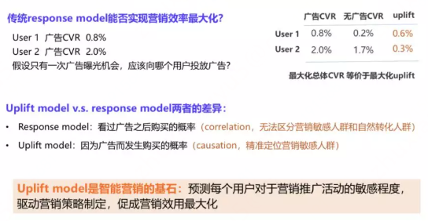

>以往经验可能会向第二类用户群投放广告，因为其转换率是最高的，但这个结论是对的吗？经过进一步分析，除了广告曝光转化率之外们还能知道这两类用户群体在没有广告触达情况下的自然转化率，从而推算出广告所带来的增量。比如第一类用户的广告转化率虽然低，但在没有广告触达情况下的转化率更低，即广告所带来的增量反而是比第二个用户更高的，而我们要最大化总体的转化率其实等价于最大化广告的增量，按照这个逻辑，我们应该向第一个用户投放广告。也就是说Response Model很有可能会误导我们做出错误的决策，Uplift Model和Response Model之所以有差异，主要在于两个模型的预测目标不一样。[例子参考](https://zhuanlan.zhihu.com/p/599355166)


- uplift模型原理

uplift模型的本质是对cate或者het函数关系的估计，就是在于找到给定某一个$X$的情况下，$Y$和$T$的真实的映射关系。

机器学习模型通常是直接预测某个结果概率。Uplift模型则预测个体对干预的反应，即干预是否有效，效果如何。Uplift模型需要同时包含干预组（接受干预）和对照组（未接受干预）的数据，并且每个个体的响应变量（如购买、点击等）和干预标记（即是否接受干预）都要被记录。

所以，Uplift模型要基于干预组的样本特征和标记进行一次模型训练，基于对照组的样本特征和标记也要训练一次。这个训练过程的模型，便可以采用CART树，GBDT，逻辑回归等机器学习模型。

下面我们抽象出 Uplift 模型的数学表达形式，假设我们有一个二元变量T代表是否接受干预：


- $T=1$ ：用户被干预（如收到促销短信、电话营销等）

- $T=0$ ：用户未被干预（对照组）

目标变量 $Y$ 表示用户的转化情况：

- $Y=1$ ：用户转化（如购买）

- $Y=0$ ：用户未转化

针对构建好的预测模型，预测样本在接受干预和未接受干预情况下的结果概率。假设 $Y_1$ 是个体接受干预后的结果，$Y_0$ 是个体未接受干预时的结果。Uplift模型的目标是预测，因干预产生的增益为：

$$
\operatorname{Uplift}(x)=P(Y=1 \mid T=1, X=x)-P(Y=1 \mid T=0, X=x)
$$


其中，$X$ 是个体特征。 $P(Y=1 \mid T=1, X=x)$ 是个体在接受干预时发生某一事件的概率，$P(Y=1 \mid T=0, X=x)$ 是个体在没有干预时发生该事件的概率。

**这个公式本质，即给定某个用户特征 $X$，在样本特征情况下，计算该用户在接受干预和未接受干预情况下的转化率差值。这个差值代表了干预的真实增量贡献。**

Uplift 模型的核心是估计 $P(Y=1 \mid T=1, X)$ 和 $P(Y=1 \mid T=0, X)$ 之间的差异。常见建模方法主要有以下几种。

（1）单模型法

将干预组和对照组数据，合并在一起，训练一个模型，这时干预动作 $T$ ，也作为一个特征纳入整个训练过程。训练模型，可以选择CART，逻辑回归，GBDT等模型。模型最终进行预测输出时，对每一个样本，输出

$$
\operatorname{Uplift}(x)=P(Y=1 \mid T=1, X)-P(Y=1 \mid T=0, X)
$$


作为最终Uplift计算结果值。

（2）双模型法

对干预组和对照组，两份数据集，分别建立两个独立的模型：

- 模型 1 （对照组）训练目标为 $P(Y=1 \mid T=0, X)$

- 模型 2 （干预组）训练目标为 $P(Y=1 \mid T=1, X)$

两个模型训练完成后，用两个模型分别同一样本在干预和不干预的情况下进行预测，计算两者的差值 作为 Uplift 评分

$$
\operatorname{Uplift}(x)=P(Y=1 \mid T=1, X)-P(Y=1 \mid T=0, X)
$$


作为最终Uplift计算结果值。


# 基础定义


- HTE heterogeneous treatment effect： 基于实验或者观测研究，检验不同子组样本之间的干预差异


- 反事实结果

对于个体 $i$ ，从历史数据中不可能同时观测到对该样本的两种潜在结果 $\tau_1$ 和 $\tau_2$ ，因此对于处理效应的计算无法直接通过 $Y_i(1)-Y_i(0)$ 获得

在样本数据中我们观测到的结果只是个体 $i$ 获得某种处理状态后对应的潜在结果 $Y_i$ ，因此 $Y_i$ 可表示为：

$$
Y_i=Y_i(0)+\left[Y_i(1)-Y_i(0)\right] \times T_i
$$


假设总共有 $M$ 个样本，处理组 $\left(T_i=1\right)$ 内共有 $K$ 个样本，控制组 $\left(T_i=0\right)$ 内有 $M-K$ 个样本

对于处理组个体，我们只能获得潜在结果 $Y_i(1)$ ，而不能获得 $Y_i(0)$ 。因果推断中，一般将未观测到的潜在结果，即与观测结果 $Y_i$ 对应的另一为观测的潜在结果称为反事实结果。也就是说，对于处理组个体，其个体观测结果和反事实结果分别为 $Y_i=Y_i(1)$ 和 $Y_i=Y_i(0)$ ；控制组则恰好相反。


- ATE：平均处理效应，如AB实验，受处理和未受处理的人群的效果的差的期望


$$
A T E=E[Y(1)-Y(0)]
$$


其中，$Y(1)$ 表示个体接受治疗时的潜在结果，$Y(0)$表示个体未接受治疗时的潜在结果。ATE提供了一个总体层面上，治疗对结果影响的平均度量，不考虑个体的特征差异。例如，在研究一种新药物对所有患者的疗效时，ATE就是所有患者中，服用药物后的平均康复情况与不服用药物时的平均康复情况的差值。


- ATT：受处理的人群的平均处理效应，受处理的人群通过PSM方法找出和他们一样的人做为替身，看他们的效果的差别


- CATE：人群中某个subgroup的平均处理效应

CATE（条件平均治疗效应）：考虑了个体特征$X$，是指在具有特定特征$X=x$的子群体中，接受治疗和未接受治疗的个体之间，结果变量的平均差异。数学表达式为：

$$
\operatorname{CATE}(x)=E[Y(1)-Y(0) \mid X=x]
$$


它反映了在给定特征 $x$ 的条件下，治疗对结果的平均影响。例如，在上述新药物研究中，CATE 可以用来分析具有特定年龄、性别、基础疾病等特征组合的患者群体，服 ${ }^{-}$物和不服用药物时康复情况的平均差异。


- ITE：个体的因果效应，也可以看成是个体的CATE

- PSM：通过 “剔除不匹配的样本、保留匹配对” 来平衡协变量，本质是 “选择样本”


$$
\begin{gathered}
\text { weight }=\frac{T}{\pi(x)}+\frac{1-T}{1-\pi(x)} \\
A T E=E\left\{\frac{T_i Y_i}{\pi\left(X_i\right)}\right\}-E\left\{\frac{\left(1-T_i\right) Y_i}{1-\pi\left(X_i\right)}\right\}
\end{gathered}
$$

- IPW：通过 “给每个样本赋予权重（处理组权重 1/π(X)，对照组权重 1/(1-π(X))）” 来平衡协变量，本质是“加权调整样本贡献”，不剔除样本，因此规避了 PSM “样本量损失” 和 “匹配粗细矛盾” 的问题。

$$
\text { weight }=\frac{T}{\pi(x)}+\frac{1-T}{1-\pi(x)}
$$


# 模型


## meta-learner

### Slearner
s 顾名思义：single model，就是一个模型都搞定
这个模型最简单，直接把treatment作为特征放进模型来预测。首先我们把 T 作为特征一起放进机器学习模型的特征， Y 是目标，然后训练一个有监督的模型 $\mu(x)=E[Y \mid X=x, T=t]$ 。然后我们改变 T 的值，就可以得到两个不同的结果，再一相减就好了：
$$\hat{\tau}(x)=\hat{\mu}(x, T=1)-\hat{\mu}(x, T=0)$$
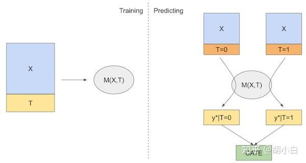

优点：简单

缺点：

- 1. 本质上还是不是对 uplift 直接进行建模，因此从效果上来说还是有提升空间。

- 2. S-Learner 倾向于将干预效果趋近于0，尤其是特征的维度非常大的时候，模型在训练的过程中极容易忽略这个干预变量。同时模型中正则化的引入，也会带来干预变量的效果稀释，正则化越强，该问题就会越大。

代码

```r

```


### TLearner

T 顾名思义：two model 需要用俩模型（可以是任何的response模型）

对于 treatment 组的样本和 control 组的样本分别独立训练一个响应模型 $\hat{\mu}_1(x)$和 $\hat{\mu}_0(x)$ 。其中 $\hat{\mu}_1(x)$ 用于拟合在施加干预的情况下响应目标 $Y$ 与特征 $X$ 的关系，即 $\mu_1(x)=E[Y \mid W=1, X=x]$ ；而 $\hat{\mu}_0(x)$ 用于拟合在未施加干预的情况下响应目标 $Y$与特征 $X$ 的关系，即 $\mu_0(x)=E[Y \mid W=0, X=x]$ 。

之后拿训练好的两个模型对于同一个样本 $x$ 的预测结果做差，就得到了 uplift 结果。

最终得到的 T－Learner 表达式为 $\hat{\tau}_T(x)=\hat{\mu}_1(x)-\hat{\mu}_0(x)$
下面是 T－Learner 算法的示意图（参考 Causal Inference for The Brave and True 这本书，因此该图部分 notation 与上文存在差异：图中的 T 对应上文的干预 $W$ ；图中的 M1和 M 0 对应上文的响应模型 $\hat{\mu}_1$ 和 $\hat{\mu}_0$ ）[参考](https://zhuanlan.zhihu.com/p/682079211)


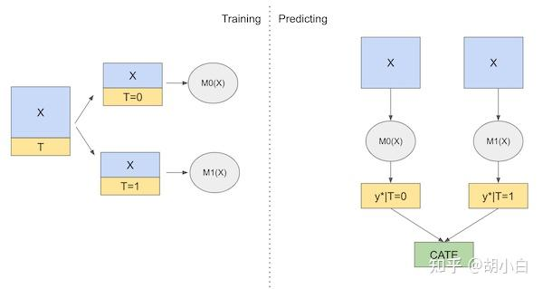


优点：可以灵活地使用已有的机器学习方法。对干预和非干预样本分别建模，充分考虑了干预因素的影响。

缺点：

- 1. T-Learner 并不是直接对 uplift 进行建模，因此对 uplift 的识别能力有限。

- 2. 考虑到其基于两个独立训练的模型进行二次处理后来对 uplift 进行预测，很容易产生两个独立模型的误差累积的问题。


### XLearner

1．参考T-learner的思路，先对于 $T=0$ 的control组和 $T=1$ 的treatment组分别学习一个有监督的模型。
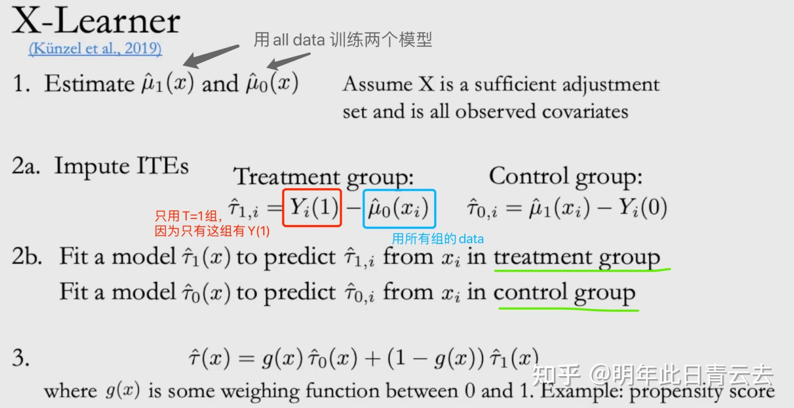

$$
\begin{aligned}
& \mu_0(x)=E\left[Y^0 \mid X=x\right] \\
& \mu_1(x)=E\left[Y^1 \mid X=x\right]
\end{aligned}
$$


2．然后对于 $\mathrm{T}=1$ 的样本和 $\mathrm{T}=0$ 的样本，分别使用 $\mu_0(x)$ 和 $\mu_1(x)$ 预测一个 $\hat{\mu}^0\left(X^1\right)$ 和 $\hat{\mu}^1\left(X^0\right)$ ，这里 $X^0, X^1$ 分别是 $\mathrm{T}=0, \mathrm{~T}=1$ 组 的样本，这步就是就是获得一个反事实的结果 （比如对于某一个 $\mathrm{T}=1$ 的样本 $X_i^1$ ，事实结果是 $Y_i^1$ ，反事实结果是 $\hat{\mu}^0\left(X_i^1\right)$ 。于是我们就可以对于control组和treatment组分别计算difference $D_i^0$ 和 $D_i^1$ ：

$$
\begin{aligned}
D_i^1 & =Y_i^1-\hat{\mu}^0\left(X_i^1\right) \\
D_i^0 & =\hat{\mu}^1\left(X_i^0\right)-Y_i^0
\end{aligned}
$$


3．最终对于一个新样本的CATE就是这两个的加权平均，权重是什么呢？一般是propensity score $g(x)=P(T=1 \mid X=x)$ ，这个可以通过一个LR模型或者任何二分类模型得到得到。最后新样本的的CATE如下：$\hat{\tau}(x)=g(x) \hat{\tau}_0(x)+(1-g(x)) \hat{\tau}_1(x)$


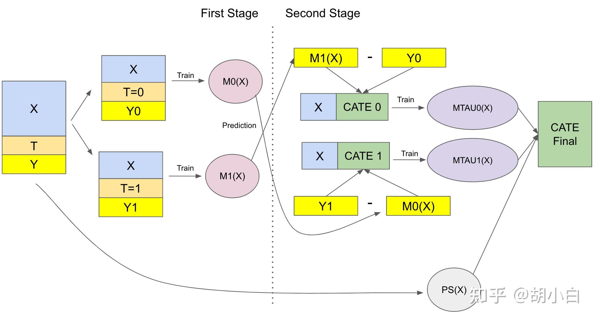
下面是 X－Learner 算法的示意图（同样参考 Causal Inference for The Brave and True 这本书，图中 notation 与上文存在差异：图中的 T 对应上文的干预 $W$ ；图中的 M0 和 M1对应前面的模型 $\hat{\mu}_0$ 和 $\hat{\mu}_1$ ；图中的 MTAU0 和 MTAU1 对应前面的模型 $\hat{\tau}_0$ 和 $\hat{\tau}_1$ ）[参考](https://zhuanlan.zhihu.com/p/682079211)


### RLearner


## Tree-base

传统机器学习模型中，树模型主要的思路就是通过对特征点进行分裂，将X划分到一个又一个subspace中，这与补贴场景下，希望找到某一小部分增量很高的用户的想法几乎是完美重合。

传统分类树模型是希望通过信息理论(information theory)中的信息熵等思想，用计算信息增益的方法去解决分类问题。而在uplift tree model中，其本质也还是想要通过衡量分裂前后的变量差值去决策是否分裂节点，不过这里的这个决策差值的计算方法不再是信息增益(information gain)，而是不同的直接对增量uplift建模的计算方法，其中包括了利用分布散度对uplift建模和直接对uplift建模。


### Casusaltree


causal tree ${ }^{+}$（honest tree）是一种直接对目标进行建模的方法，它改进了传统决策树的优化目标和指标分桶方式，以达到最大化分桶的异质性因果效应，同时调整误差的效果。

首先，它会把数据分成训练集和估计集，一部分训练集去构造树，另外一部分估计集去估计因果效应和方差。

传统决策树将SSE作为目标函数，而causal tree的目标函数如下：

$$
F\left(S_l\right)=N_l * \tau^2\left(S_l\right)-N_l\left(\frac{\operatorname{Var}\left(S_l, 1\right)}{p}+\frac{\operatorname{Var}\left(S_l, 0\right)}{1-p}\right)
$$


其中，前半部分代表实验组的treatment effect，后半部分代表实验组和对照组的 variance。

通俗理解构建causal tree的过程：首先将训练机划分为训练集和评估集两部分，用训练集训练生成一颗决策树，训练的目标函数同时考虑了实验效应（最大）和方差（最小）。然后用评估集来估计CATE作为该叶子结点的CATE，对于新样本将会用该CATE作为预测值。[参考](https://zhuanlan.zhihu.com/p/688168539)


### CasusalForest

因果森林（Causal Forest）由 Susan Athey 和 Stefan Wager 等大牛提出（2019），本质是广义随机森林（GRF）在因果推断场景的特化应用。因果森林的核心思想在于将随机森林改造为一个专门用于估计异质性因果效应的强大工具。传统的回归树分裂准则是让数据集平均MSE最小化，因果森林是通过 uplift 增益导向的分裂准则，引导树结构主动寻找处理效应发生变化的边界，从而自适应地将样本划分为协变量和处理组／对照组都相对平衡的局部子群体（近似局部 RCT）。分裂标准表达式为：


$$
\Delta\left(C_1, C_2\right)=\frac{n_{C_1} n_{C_2}}{n_P^2}\left(\hat{\theta_{C_1}}-\hat{\theta_{C_2}}\right)^2
$$


$P$代表决策树父节点， $C_1$和$C_2$是分裂后的 2 个子节点，$\theta$ 是两个子集的平均处理效应。因为两个子集中既有 $\mathrm{T}=1$ 的样本，也有 $\mathrm{T}=0$ 的样本，所以可以计算出平均处理效应，即平均增益。$n$代表各集合的样本数目。决策树分裂要求上述表达式的值最大化。

- $\Delta\left(C_1, C_2\right)$ ：表示类别 $C_1$ 和 $C_2$ 之间的＂差异值＂，是整个公式要计算的核心结果。
- $n_{C_1}$ ：类别 $C_1$ 中的样本数量（或观测数）。
- $n_{C_2}$ ：类别 $C_2$ 中的样本数量（或观测数）。
- $n_P$ ：总体（或父群体、合并群体）的总样本数量（即 $n_P=n_{C_1}+n_{C_2}$ ，如果 $C_1$ 和 $C_2$ 是总体的仅有的两个子组）。
- $\hat{\theta}_{C_1}$ ：对类别 $C_1$ 中某个参数 $\theta$ 的估计值（比如均值、处理效应、概率等，具体含义由研究场景决定）。
- $\hat{\theta}_{C_2}$ ：对类别 $C_2$ 中参数 $\theta$ 的估计值。

公式逻辑与意义
公式的核心是***组间参数差异的加权平方***，权重由＂组样本量占总体的比例＂决定：

- 分子部分：$n_{C_1} n_{C_2}\left(\hat{\theta}_{C_1}-\hat{\theta}_{C_2}\right)^2$
- $\left(\hat{\theta}_{C_1}-\hat{\theta}_{C_2}\right)^2$ ：直接衡量两个组的参数估计值的＂平方差＂，差越大，组间差异越显著。
- $n_{C_1} n_{C_2}$ ：是对＂组样本量＂的加权——如果某组样本量很大，会让这部分权重更高，体现＂大样本组的差异更值得关注＂ （或更能代表群体特征）。
- 分母部分：$n_P^2$
对分子的 “样本量加权” 做归一化，避免因总体样本量$n_P$过大导致 $Δ$数值无限制膨胀，让结果更具可比性。


传统的回归树，叶子结点预测结果是叶子结点上样本的响应变量平均值。类似的，因果树预测的结果是，叶子结点上的平均 CATE，以发优惠券为例，叶子结点预测的结果就是该节点上发券样本的平均转化率－不发券样本的平均转化率。


因果森林对比随机森林的差异


| 差异点                 | 随机森林                                                                 | 因果森林                                                                 |
| :--------------------- | :----------------------------------------------------------------------- | :----------------------------------------------------------------------- |
| 目标                   | 目标是预测一个观测值的结果 Y（分类或回归）。<br>分裂准则（如基尼系数、信息增益、均方误差）旨在最大化节点内结果的同质性或最小化预测误差。 | 核心目标直接是估计每个个体或相似群体（叶子节点）的处理效应 $τ(x) = E[Y(1)-Y(0) \mid X=x]$。<br>它不再直接预测 Y，而是预测 $Y(1) - Y(0)$ 这个反事实差异。<br>森林中的每一棵树都旨在构建一个能将样本划分为处理效应尽可能同质的子群体（叶子节点）的结构。 |
| 分裂准则               | 传统分裂准则（如 MSE）在存在处理变量T时，会倾向于选择那些能同时很好预测Y且与T 相关的变量（即混杂因素）。但这会导致分裂后的子节点内，处理组和对照组在协变量分布上仍然不平衡（混杂未完全消除），从而污染了处理效应的估计。 | 因果森林的分裂准则专门设计用于最大化子节点间处理效应的异质性或最小化子节点内处理效应估计的方差，常用准则包括：<br>• 基于 CATE 差异最大化：在候选分裂点，计算分裂后左右子节点的 CATE（$τ_L$ 和 $τ_R$）差异 $|τ_L - τ_R|$，选择差异最大的变量和分裂点（驱动树寻找效应突变边界）；<br>• 基于负梯度（梯度提升视角）：将 CATE 估计视为优化问题，用处理效应损失函数（如均方处理效应误差）的负梯度作为伪残差，指导分裂方向以减少 CATE 估计误差。 |
| 集成学习与Honest Estimation | 基于“bootstrap抽样+随机特征选择”构建多棵决策树，集成时直接对每棵树的预测结果（分类概率/回归值）取平均，无“分裂与效应估计的样本分离”设计，未针对因果效应优化无偏性。 | 1. 集成逻辑：与随机森林类似，构建数百棵“因果树”，每棵树基于随机子样本+随机特征子集训练，引入随机性以降低方差；<br>2. 双重样本利用（Honest Estimation）：<br>   • 训练样本（S1）：仅用于构建树结构（决定分裂规则），不参与效应计算；<br>   • 估计样本（S2）：与S1无交集（或通过Out-of-bag抽样实现），仅“落入”已训练好的树的叶子节点，用于计算该节点的效应 $τ_{leaf}$（处理组与对照组均值差）；<br>3. 核心优势：<br>   • 防过拟合：避免用同一批样本（S1）既建结构又算效应，减少噪声导致的偏差；<br>   • 无偏性：满足独立性条件时，可提供渐近无偏的CATE估计；<br>4. 最终预测：新样本输入所有因果树，取各树输出的 $τ_{leaf}$ 均值（或中位数）作为最终CATE结果，集成平均提升估计稳定性。 |


### DML

DML（double machine learning）是指一种用于因果推断的方法，它结合了现代机器学习技术与传统计量经济学方法，旨在从观测数据中准确估计因果效应。具体来说，double machine learning（DML）通过两个独立的预测步骤来实现这一目标：

第一阶段：使用机器学习模型预测结果变量 Y 和处理变量 T 关于协变量 X 的值。这一过程涉及两个模型的训练：一个是预测Y，另一个是预测T。

$$
\begin{aligned}
& Y^{\prime}=f_1(X)+\varepsilon \\
& T^{\prime}=f_2(x)+\varepsilon
\end{aligned}
$$


第二阶段：计算第一阶段预测值与实际值的残差，即得到 Y 的残差和 T 的残差。这些残差去除了协变量X的影响。


$$
\begin{aligned}
& \Delta Y=Y-Y^{\prime} \\
& \Delta T=T-T^{\prime}
\end{aligned}
$$


回归分析：最后，对这些残差进行线性回归，以估计处理变量 T 对结果变量 Y 的因果效应。

$$
\Delta Y=\mu(x) * \Delta T+\varepsilon
$$


最终 $\mu(x)$ 即为输出结果。
这种方法的核心在于构造＂正交化＂得分，即通过残差来消除协变量的混杂影响，从而实现无偏的因果效应估计。DML特别适用于高维数据和复杂非线性关系的情况，因为它能够利用灵活的机器学习模型来处理大量控制变量，同时保持估计的稳健性。将 DML里面的模型换成随机森林就是CausalForestDML。

总结

不同于传统的拟合Y
DML提出直接拟合ATE，并利用残差消偏
拟合目标

$$
\tilde{Y}_i=\tilde{T}_i * \tau\left(X_i\right)+\epsilon
$$


其中 $\tilde{Y}_i=Y_i-\hat{Y}_i, \tilde{T}_i=T_i-\hat{T}_i$, where $\hat{Y}_i=E\left[Y_i \mid X_i\right], \hat{T}_i=E\left[T_i \mid X_i\right]$ 目标是最小化 $|\epsilon| \tau\left(X_i\right)$ 即 ate

通过cross－fitting降低偏差，样本分为不相交 $\mathrm{n}(n \geq 2)$ 份，保证估计残差和计算 $\tau\left(X_i\right)$ 的不是同一份数据为什么需要DML？

1．引入学习残差的uplift模型
2．消偏，消偏指的是消除观测样本由于confounder造成的偏差。

### DRL

在 DR－Learner（双重稳健学习）中，构造Pseudo－outcome（伪结果）$\hat{\varphi}\left(Z_i\right)$ 是实现＂双重稳健性＂的核心步骤，其本质是通过整合＂倾向得分加权＂与＂结果模型预测＂，生成一个能用于估计个体处理效应（ITE）的中间变量，具体可从定义、构成逻辑、作用及后续应用四方面理解：

一、Pseudo－outcome $\hat{\varphi}\left(Z_i\right)$ 的定义与构成

根据文档中式（2），伪结果 $\hat{\varphi}\left(Z_i\right)$ 的计算公式为：

$$
\widehat{\varphi}\left(Z_i\right)=\left(\frac{T_i\left(Y_i-\hat{\mu}_1\left(X_i\right)\right)}{\hat{\pi}\left(X_i\right)}+\hat{\mu}_1\left(X_i\right)\right)-\left(\frac{\left(1-T_i\right)\left(Y_i-\hat{\mu}_0\left(X_i\right)\right)}{1-\hat{\pi}\left(X_i\right)}+\hat{\mu}_0\left(X_i\right)\right)
$$


其中各符号的含义需结合 DR－Learner 的前期准备步骤（文档 Step 1）理解：

- $Z_i=\left(X_i, T_i, Y_i\right)$ ：第 $i$ 个样本的完整数据，包含协变量 $X_i$ 、处理状态 $T_i(1=$ 接受处理， $0=$ 未接受处理 $)$ 、结果变量 $Y_i$ ；

- $\hat{\pi}\left(X_i\right)$ ：基于部分数据集（如 $D_1^n$ ）估计的倾向得分，即＂给定 $X_i$ 时 $T_i=1$ 的概率＂；

- $\hat{\mu}_1\left(X_i\right) 、 \hat{\mu}_0\left(X_i\right)$ ：同样基于 $D_1^n$ 估计的结果模型，分别表示＂给定 $X_i$ 且 $T=1$ 时 $Y$ 的条件期望＂$\left(\mathbb{E}\left(Y \mid T=1, X_i\right)\right)$ 和＂给定 $X_i$ 且 $T=0$ 时 $Y$ 的条件期望＂$\left(\mathbb{E}\left(Y \mid T=0, X_i\right)\right)$ 。

从公式结构看，$\hat{\varphi}\left(Z_i\right)$ 由两部分差值构成：减号左侧对应＂处理组视角的调整后结果＂，右侧对应＂对照组视角的调整后结果＂，差值直接反映了＂基于当前样本特征 $X_i$ 的处理效应估计＂。

二、构造逻辑：整合两种去偏思路，实现双重稳健

伪结果的核心设计逻辑，是将 DR－Learner 的＂双重稳健＂理念嵌入计算过程——它同时融合了＂倾向得分加权（IPW）＂和＂回归调整（RA）＂两种去偏思路，确保即使其中一种思路的模型（倾向得分模型 $\hat{\pi}$ 或结果模型 $\hat{\mu}$ ）存在偏差，另一种思路仍能保证估计的有效性，具体拆解如下：

1．减号左侧：处理组视角的调整（对应 $T=1$ 的情况）
左侧表达式 $\frac{T_i\left(Y_i-\hat{\mu}_1\left(X_i\right)\right)}{\hat{\pi}\left(X_i\right)}+\hat{\mu}_1\left(X_i\right)$ 可拆分为两部分：

- 第一部分 $\frac{T_i\left(Y_i-\hat{\mu}_1\left(X_i\right)\right)}{\hat{\pi}\left(X_i\right)}$ ：本质是＂倾向得分加权的残差项＂——用 $\hat{\pi}\left(X_i\right)$ 对＂实际结果 $Y_i$ 与结果模型预测值 $\hat{\mu}_1\left(X_i\right)$ 的残差＂加权，这一步延续了 IPW＂通过权重平衡协变量分布＂的思路；

第二部分 $\hat{\mu}_1\left(X_i\right)$ ：是结果模型对＂$T=1$ 时 $Y$ 的预测值＂，代表＂回归调整＂的思路，直接利用协变量 $X_i$ 预测处理组的潜在结果。

两者相加后，左侧整体近似＂处理组的真实潜在结果估计值＂（即 $\mathbb{E}\left(Y \mid T=1, X_i\right)$ ）。

2．减号右侧：对照组视角的调整（对应 $T=0$ 的情况）
右侧表达式 $\frac{\left(1-T_i\right)\left(Y_i-\hat{\mu}_0\left(X_i\right)\right)}{1-\hat{\pi}\left(X_i\right)}+\hat{\mu}_0\left(X_i\right)$ 与左侧逻辑对称：


- 第一部分 $\frac{\left(1-T_i\right)\left(Y_i-\hat{\mu}_0\left(X_i\right)\right)}{1-\hat{\pi}\left(X_i\right)}$ ：用＂1－倾向得分＂对对照组的残差加权，平衡对照组的协变量分布； 

- 第二部分 $\hat{\mu}_0\left(X_i\right)$ ：结果模型对＂$T=0$ 时 $Y$ 的预测值＂，即 $\mathbb{E}\left(Y \mid T=0, X_i\right)$ 。

两者相加后，右侧整体近似＂对照组的真实潜在结果估计值＂。

3．差值的意义：直接关联 ITE
由于＂个体处理效应（ITE）＂的定义是＂处理组潜在结果与对照组潜在结果的差值＂ $\left.\tau\left(X_i\right)=\mathbb{E}\left(Y \mid T=1, X_i\right)-\mathbb{E}\left(Y \mid T=0, X_i\right)\right)$ ，因此 $\hat{\varphi}\left(Z_i\right)$ 作为＂处理组与对照组调整后结果的差值＂，天然成为ITE 的直接估计载体——这也是其被称为＂伪结果＂的核心原因：它并非真实观测到的结果，而是为了估计ITE构造的＂中间替代结果＂。

三、简化形式：更清晰的稳健性体现
为进一步凸显稳健性逻辑，文档将式（2）简化为式（3）：

$$
\widehat{\varphi}\left(Z_i\right)=\frac{T-\hat{\pi}\left(X_i\right)}{\hat{\pi}\left(X_i\right)\left\{1-\hat{\pi}\left(X_i\right)\right\}}\left\{Y-\hat{\mu}_T\left(X_i\right)\right\}+\hat{\mu}_1\left(X_i\right)-\hat{\mu}_0\left(X_i\right)
$$


其中 $\hat{\mu}_T\left(X_i\right)$ 是＂与样本实际处理状态匹配的结果模型预测值＂（即 $T=1$ 时取 $\hat{\mu}_1\left(X_i\right), T=0$ 时取 $\hat{\mu}_0\left(X_i\right)$ ）。

简化后公式更清晰地展现了＂双重稳健＂的本质：

- 若倾向得分模型 $\hat{\pi}\left(X_i\right)$ 准确（即 $\hat{\pi}\left(X_i\right) \approx \pi\left(X_i\right)$ ），则 $\frac{T-\hat{\pi}\left(X_i\right)}{\hat{\pi}\left(X_i\right)\left\{1-\hat{\pi}\left(X_i\right)\right\}}\left\{Y-\hat{\mu}_T\left(X_i\right)\right\}$ 项近似为 0，此时 $\hat{\varphi}\left(Z_i\right) \approx \hat{\mu}_1\left(X_i\right)-\hat{\mu}_0\left(X_i\right)$ ，仅依赖结果模型即可实现有效估计；

- 若结果模型 $\hat{\mu}_T\left(X_i\right)$ 准确（即 $\hat{\mu}_T\left(X_i\right) \approx \mathbb{E}\left(Y \mid T, X_i\right)$ ），则 $\left\{Y-\hat{\mu}_T\left(X_i\right)\right\}$ 项近似为 0 ，此时 $\hat{\varphi}\left(Z_i\right)$ 的核心由倾向得分加权项主导，仅依赖倾向得分模型也可实现有效估计。


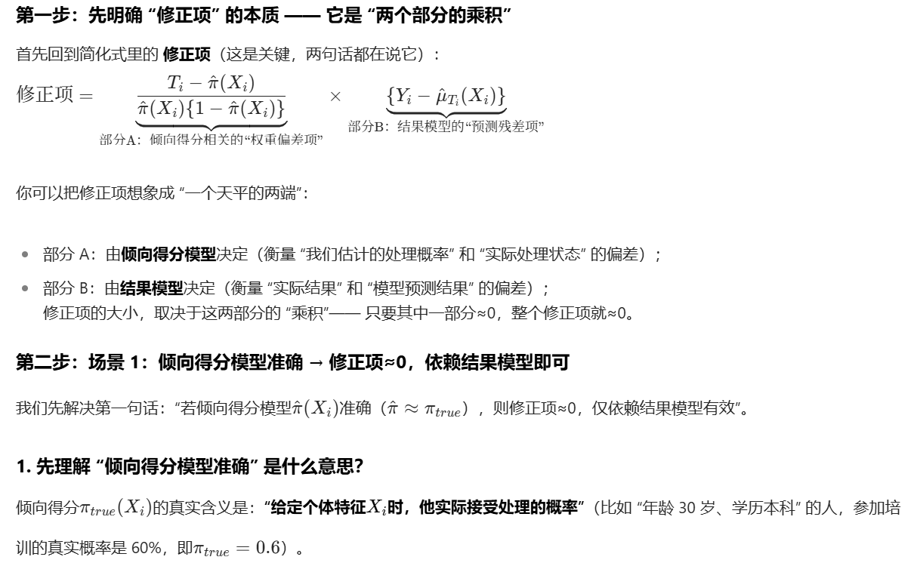
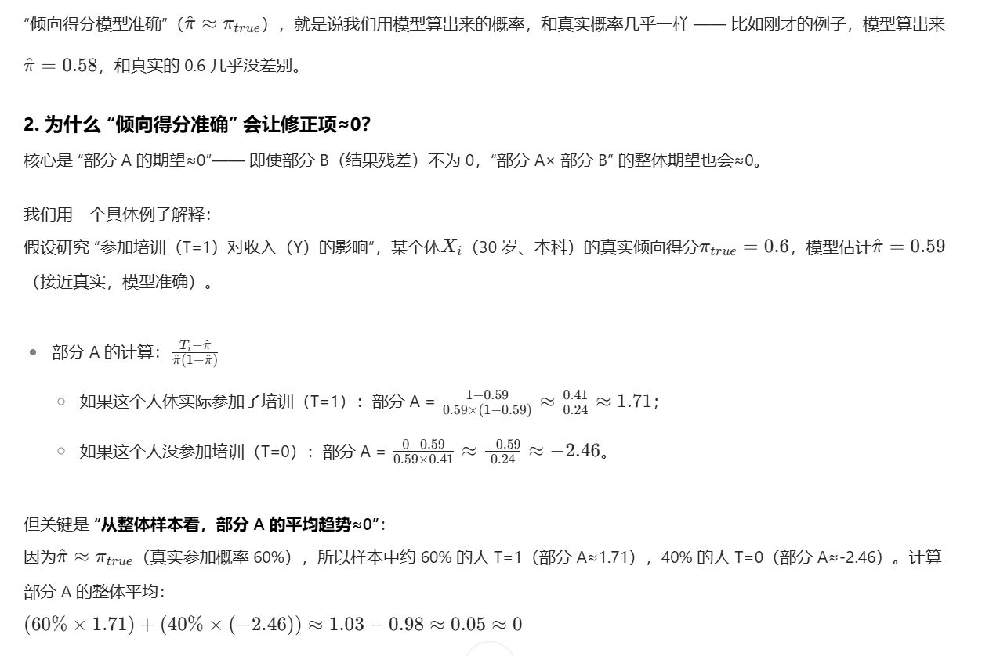
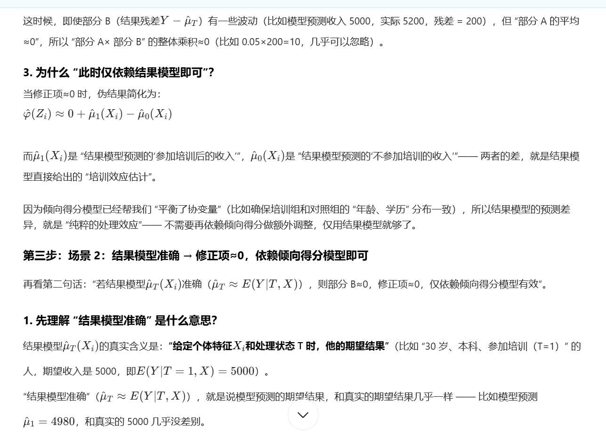
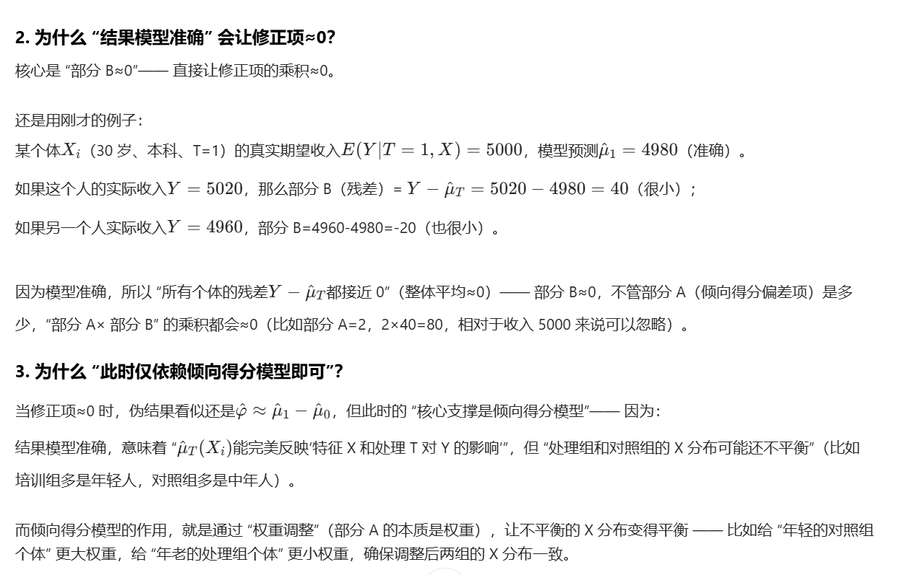
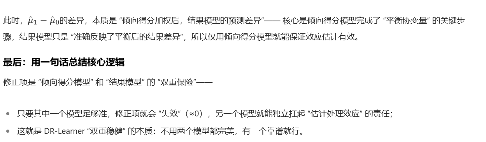


这种＂两种模型只需一个准确＂的特性，正是伪结果能让 DR－Learner 具备＂双重稳健性＂的关键。
四、Pseudo－outcome 的后续应用：估计 ITE 与 ATE
构造伪结果 $\hat{\varphi}\left(Z_i\right)$ 后，需结合文档中提到的＂交叉拟合（Cross－fitting）＂流程完成最终的效应估计：

1．生成全样本伪结果：先用 $D_1^n$ 训练 $\hat{\pi} 、 \hat{\mu}_1 、 \hat{\mu}_0$ ，对 $D_2^n$ 计算 $\hat{\varphi}\left(Z_i\right)$ ；再交换数据集角色（用 $D_2^n$ 训练模型，对 $D_1^n$ 计算 $\hat{\varphi}\left(Z_i\right)$ ），最终得到所有样本的伪结果；

2．估计 ITE：有两种方式——直接将 $\hat{\varphi}\left(Z_i\right)$ 作为 ITE 的粗估计，或基于协变量 $X$ 对 $\hat{\varphi}\left(Z_i\right)$ 拟合回归模型，得到更精准的 ITE 预估函数 $\hat{\tau}(X)$（即 $\hat{\tau}(X)=\mathbb{E}\{\hat{\varphi}(Z) \mid X=x\}$ ）；

3．估计 ATE：将全样本的 $\hat{\varphi}\left(Z_i\right)$ 取平均值，即可得到平均处理效应（ATE）的估计，这也与文档中后续提到的 ATE 表达式（式 4）逻辑一致。

综上，Pseudo－outcome $\hat{\varphi}\left(Z_i\right)$ 是 DR－Learner 连接＂模型训练＂与＂效应估计＂的核心桥梁：它通过整合两种去偏思路实现双重稳健，既解决了单一模型（如 IPW 仅依赖倾向得分、回归调整仅依赖结果模型）的脆弱性，又为 ITE／ATE 的估计提供了直接且可靠的中间变量。


## 深度因果模型

### TARNET

深度因果模型的基础网络，很多后续的网络都是在此基础上拓展的.为了让神经网络学习到的表示相近，Shalit et al．（2017）提出了Treatment Agnostic Regression Network（TARNet）。它的思想很简单，神经网络整体为双头结构，然后像 multi－task一样的共享层去学习共有的信息表征 $\phi(x)$ ，再利用该共享表征去分别学习treated组和control的outcome结果。共享层其实就会在treated和control组的信息中进行tread off，从而达到一种balanced。
简言之：TARNet前半部分用的是整个数据集，但是在后两个分支分别用的是T=0和T=1的分组数据各自训练所属的分支。

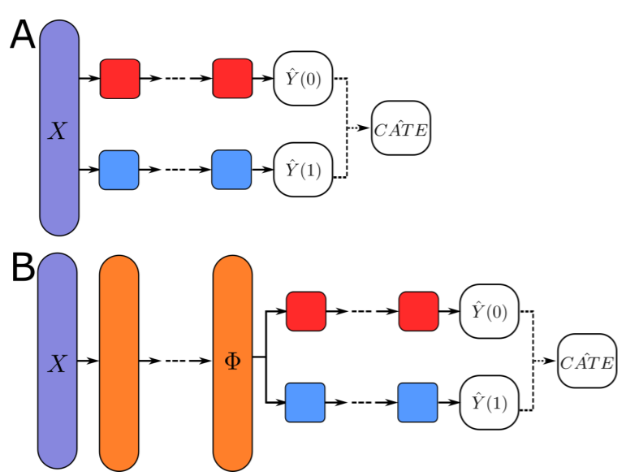
图a是T-Learner，图b是tarnet，其中tarnet在2元treatment的loss如下：[参考](https://zhuanlan.zhihu.com/p/603499723)
$$
\underset{h, \Phi}{\arg \min } \frac{1}{N} \sum_{i=1}^N \operatorname{MSE}(Y_i\left(T_i\right), \underbrace{h\left(\Phi\left(X_i\right), T_i\right)}_{\hat{Y}_i\left(T_i\right)})+\lambda \underbrace{\mathcal{R}(h)}_{L_2}
$$

这个公式的核心是 **“带正则化的最小均方误差优化”**：通过调整函数 $h$ 和特征映射 $Φ$，让模型对所有样本的 “预测值与真实值的均方误差之和” 尽可能小，同时通过正则化项 $λR(h)$限制 $h$的复杂度，避免模型过度拟合训练数据（即保证模型在新数据上也能有好的表现）


Tarnet本质就是一个共享底座的t-learner，共享层学习共有的信息表征，再利用该共享表征去分别学习treat组和control的输出结果，共享层就会在treat和control组的信息中进行trade off，从而达到一种平衡。

```r
import torch
import torch.nn as nn
import torch.nn.functional as F

class TARNet(nn.Module):
    def __init__(self, input_dim, hidden_dim=200, output_dim=1):
        super(TARNet, self).__init__()
        
        # 共享表示层
        self.shared_layers = nn.Sequential(
            nn.Linear(input_dim, hidden_dim),
            nn.ReLU(),
            nn.Dropout(0.3),
            nn.Linear(hidden_dim, hidden_dim),
            nn.ReLU(),
            nn.Dropout(0.3)
        )
        
        # 控制组预测头
        self.y0_head = nn.Sequential(
            nn.Linear(hidden_dim, hidden_dim//2),
            nn.ReLU(),
            nn.Linear(hidden_dim//2, output_dim)
        )
        
        # 处理组预测头  
        self.y1_head = nn.Sequential(
            nn.Linear(hidden_dim, hidden_dim//2),
            nn.ReLU(),
            nn.Linear(hidden_dim//2, output_dim)
        )
        
    def forward(self, x):
        # 共享表示
        phi = self.shared_layers(x)
        
        # 分别预测两种潜在结果
        y0_pred = self.y0_head(phi)
        y1_pred = self.y1_head(phi)
        
        return y0_pred, y1_pred, phi

def tarnet_loss(y0_pred, y1_pred, y_true, t, phi, alpha=1.0):
    """
    TARNet损失函数,alpha=0即为TARNet,alpha>0即为CFRNet
    
    Args:
        y0_pred: 控制组预测
        y1_pred: 处理组预测  
        y_true: 真实结果
        t: 处理指示符 (0或1)
        phi: 学习到的表示
        alpha: 平衡正则化强度
    """
    
    # 预测损失
    y_pred = t * y1_pred + (1 - t) * y0_pred
    pred_loss = F.mse_loss(y_pred.squeeze(), y_true)
    
    # 表示平衡正则化（简化版）
    # 这里使用MMD距离或者其他分布距离度量
    phi_treated = phi[t == 1]
    phi_control = phi[t == 0]
    
    if len(phi_treated) > 0 and len(phi_control) > 0:
        balance_loss = torch.norm(phi_treated.mean(0) - phi_control.mean(0))
    else:
        balance_loss = torch.tensor(0.0)
    
    total_loss = pred_loss + alpha * balance_loss
    
    return total_loss, pred_loss, balance_loss

```

###  CFRnet 

tarNet+IPM loss

CFRnet的核心思想其实就是在tarnet的基础上加入额外的loss，修正衡量treated组和control组的分布距离，进一步平衡treated和control组在表示空间中的分布，该距离被称为integral probability metrics（IPM）。论文中使用了两种IPM包括Maximum Mean Discrepency和Wasserstein distance。当两个组分布平衡时，满足
，IPM为0，即代表treat组和control组分布一致。


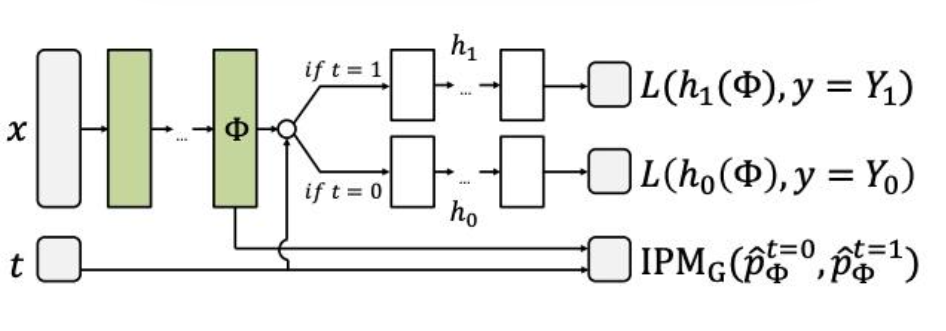


损失函数：就是tarnet 损失函数基础上加入IPM loss。

$$
\mathcal{L}=\mathcal{L}_{\text {pred }}+\alpha \cdot \operatorname{IPM}\left(R_0, R_1\right)
$$

-  $\mathcal{L}_{\text {pred }}$ ：预测 $Y$ 的均方误差（只对所观测到的分支计算）
- IPM：Integral Probability Metric，用来约束处理组／对照组的表示分布差异（常见是 MMD 或 Wasserstein）。

Note：CFRnet 加入 IPM loss，理论上就是力求去掉混淆变量中和T相关（共线）的特征，用剩余的混淆变量对Y进行回归，来避免 observable confounder稀释掉Treatment 对 outcome的相关性。但是实际使用中真的有效果么？这里按下不表，读者们可以思考下这种方式可能带来的影响。


### Dragonnet

DragonNet：TarNet + Propensity Head
DragonNet 也是共享表示 + 双头预测的结构，但它额外引入了：

第三个预测头：Propensity Head，用来显式估计处理分配概率 
。
这么做的好处：

在端到端训练中同时学习倾向得分（Propensity Score）和潜在结果预测；
用倾向得分在损失里引入Targeted Regularization，提升因果效应估计的无偏性。

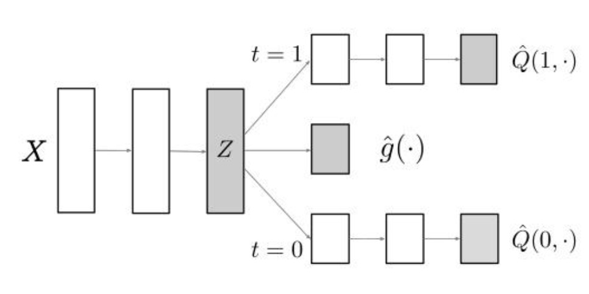

损失函数：

$$
\hat{R}(\theta ; X)=\frac{1}{n} \sum_i^{\nabla}\left[\left(Q^{\mathrm{nn}}\left(t_i, x_i ; \theta\right)-y_i\right)^2+\alpha \operatorname{CrossEntropy}\left(g^{\mathrm{nn}}\left(x_i ; \theta\right), t_i\right)\right]
$$


两个 outcome 头的 mse loss＋treatment 因子的ce loss

基于半参估计的理论性质，论文还引入了 Targeted Regularization损失正则项：

$$
\varphi(y, t, x ; Q, g, \psi)=Q(1, x)-Q(0, x)+\left(\frac{t}{g(x)}-\frac{1-t}{1-g(x)}\right)\{y-Q(t, x)\}-\psi .
$$


最终loss：

$$
\mathcal{L}=\mathcal{L}_{\text {pred }}+\alpha \cdot \mathcal{L}_{\text {propensity }}+\beta \cdot \mathcal{L}_{\text {targetedRegularization }}
$$


DragonNet 的技巧是：

- 输出 $\hat{Y}^0, \hat{Y}^1, \hat{e}$

- 主损失依旧是预测的平方误差（根据 $T$ 选择对应头）

- 辅损失是交叉嫡（预测 Propensity）

- 可选：加 Targeted Regularization，让模型在训练过程中就利用倾向得分逼近 ATE

- DragonNet的纠偏原理：

DragonNet的纠偏效果到底来源于什么？为什么只是单纯加了一个treatment-head就能纠偏？是否真正效果来源于正则？要回答这个问题，我们需要先回顾一下因果推断中对特征的经典分类。

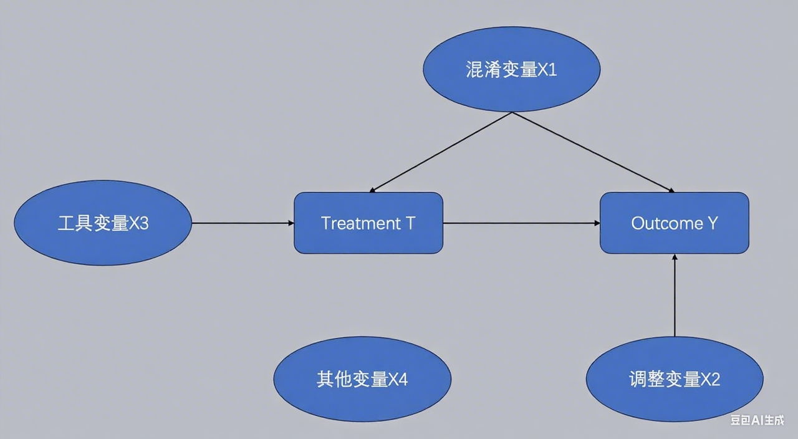
   

如上图，我们可以把特征分为4个类：

- 混淆变量X1，既影响T又影响Y，只有把所有的$X_c$放入模型才能保证无偏。

- 调整变量X2，只影响结果Y，若放进模型里可以提升模型预测的精度。

- 工具变量X3，只影响T，若放进模型里会导致因果效应的估计有偏。

- 其他变量X4，不影响T也不影响Y，放进模型里不会影响无偏性。

（理论上还有一个调节变量，通过影响T来影响Y，此处不介绍）
可以看到，如果要去除观测数据中的偏置，应该尽可能加强对混淆变量的识别。简单举例：营销场景下，不同活跃度用户发券的概率一般是不一样的，倾向于对不活跃的用户发券来拉活，则用户活跃度即为混淆变量，如果不按照活跃度分层后观测ATE，则会得出结论，发券vs不发券的ATE为负。

回顾DragonNet的结构变化，加入Propensity-Head后，使得confounder表征层和Propensity-Score紧紧相连在一起，此时表征向量Z(X)则正为既影响T也影响Y的混淆变量（对比TarNet则是调节变量为主），而这正是DragonNet能纠偏的核心原理，正则更多是一种锦上添花。


```r

class DragonNet(nn.Module):
    def __init__(self, input_dim, hidden_dim=200, output_dim=1):
        super(DragonNet, self).__init__()
        
        # 共享表示层
        self.shared_layers = nn.Sequential(
            nn.Linear(input_dim, hidden_dim),
            nn.ELU(),
            nn.Dropout(0.1),
            nn.Linear(hidden_dim, hidden_dim),
            nn.ELU(),
            nn.Dropout(0.1)
        )
        
        # 倾向性分数预测头
        self.propensity_head = nn.Sequential(
            nn.Linear(hidden_dim, hidden_dim//2),
            nn.ELU(),
            nn.Linear(hidden_dim//2, 1),
            nn.Sigmoid()
        )
        
        # 控制组预测头
        self.y0_head = nn.Sequential(
            nn.Linear(hidden_dim, hidden_dim//2),
            nn.ELU(), 
            nn.Linear(hidden_dim//2, output_dim)
        )
        
        # 处理组预测头
        self.y1_head = nn.Sequential(
            nn.Linear(hidden_dim, hidden_dim//2),
            nn.ELU(),
            nn.Linear(hidden_dim//2, output_dim)
        )
        
    def forward(self, x):
        # 共享表示
        phi = self.shared_layers(x)
        
        # 三个预测头
        propensity = self.propensity_head(phi)
        y0_pred = self.y0_head(phi) 
        y1_pred = self.y1_head(phi)
        
        return propensity, y0_pred, y1_pred, phi

def dragonnet_loss(propensity, y0_pred, y1_pred, y_true, t, 
                   alpha=1.0, beta=1.0):
    """
    DragonNet损失函数
    
    Args:
        propensity: 倾向性分数预测
        y0_pred: 控制组预测
        y1_pred: 处理组预测
        y_true: 真实结果
        t: 处理指示符
        alpha: 倾向性分数损失权重
        beta: 正则化权重
    """
    
    # 倾向性分数损失
    prop_loss = F.binary_cross_entropy(propensity.squeeze(), t.float())
    
    # 结果预测损失
    y_pred = t * y1_pred + (1 - t) * y0_pred
    outcome_loss = F.mse_loss(y_pred.squeeze(), y_true)
    
    # 正则化项（基于倾向性分数的加权）
    weights = t / propensity.squeeze() + (1 - t) / (1 - propensity.squeeze())
    weighted_outcome_loss = (weights * (y_pred.squeeze() - y_true) ** 2).mean()
    
    total_loss = outcome_loss + alpha * prop_loss + beta * weighted_outcome_loss
    
    return total_loss, outcome_loss, prop_loss


```


三个基础模型对比


- Tarnet本质就是一个共享底座的t-learner，希望通过共享层在treat和control组的信息中进行trade off，从而达到一种平衡。

- CFR-net 在Tarnet基础上加入IPM loss，力求去掉混淆变量中和T共性的特征，用剩余的confounder对Y进行回归，来避免observable confounder稀释掉Treatment 对 outcome的相关性。

- Dragon-net 在Tarnet基础上增加倾向性分数预估正则，即在模型 loss 函数上增加cross_entropy(p(x), t) 让模型能更关注到混淆变量。


### EFIN

### DESCN

模型整体有两部分结构组成ESN网络+Xnetwork网络


解决的问题

- 干预偏差问题 Treatment Bias： 即被干预Treatment组（实验组）和未干预Control 组（对照组）的分布是不同的。

- 样本不均衡问题 Sample Imbalance：干预的Treatment 组和未干预的Control 组样本差异大，样本不平衡。

问题根源：Treatment Bias 和 Sample Imbalance 都源于非随机的观测数据。

Treatment Bias 是因为处理分配（W）与协变量也就是特这（X）和潜在结果（Y(0), Y(1)）不独立，即存在混淆变量。

Sample Imbalance 虽然有时是策略本身导致的（如只对1%的用户发券），但在非随机环境下，这种数量上的不平衡会加剧模型学习的难度。


理论上来说，RCT实验数据是可以一定程度避免这俩问题的。
本文方法的三个假设：

- 一致性Consistency：$y_i=y_i\left(w_i\right)$ ，观测到的 $y_i$ 和 潜在的 $y_i\left(w_i\right)$ 是一致的，即干预对结果的影响是稳定的。

- 可忽略性Ignorability：$Y(1), Y(0) \perp T \mid X$ ，意思是没有其他未观察到的混淆变量存在；

- 重叠Overlap： $0<\pi(x)<1$ ，即干预的施加是不确定的，存在倾向性。

**ITE的基本框架**

1. 样本数据集定义

令观察样本为$D=\left\{y_i, x_i, w_i\right\}_{i=1}^n$：表示包含$n$个样本的数据集，每个样本包含三个核心变量：
$\mathrm{y}, \mathrm{x}, \mathrm{w}$ 分别表示效果标签、特征、是否被干预。每一个样本的 $y_i \in\{0,1\}$ ，表示binary的 outcome；每一个样本的 $w_i \in\{0,1\}$ 表示binary的treatment，当 $w_i=1$ 表示有干预，当 $w_i=0$ 表示无干预。

被干预的倾向性得分估计表示为 $\pi(x)=P(W=1 \mid X=x)$ 。
$T=\left\{i: w_i=1\right\}$:干预样本的集和 $C=\left\{i: w_i=0\right\}$ ：对照组的样本集和。

2．倾向性得分（Propensity Score）

- 定义：$\pi(x)=P(W=1 \mid X=x)$ ，表示在给定特征 $x$ 的条件下，样本接受干预（ $W=1$ ）的概率。

- 作用：倾向性得分是因果推断中的重要工具，常用于平衡实验组和对照组的特征分布，减少混杂偏倚（confounding bias）。

3．干预效应的核心定义

要估计干预对结果的影响，需明确两个条件期望：

- 干预组响应（TR）：$\mu_1(x)=\mathbb{E}(Y \mid W=1, X=x)$表示＂在特征为 $x$ 且接受干预（ $W=1$ ）的条件下，结果 $Y$ 的期望＂（即特征为 $x$ 的样本接受干预后的平均结果）。

- 对照组响应（CR）：$\mu_0(x)=\mathbb{E}(Y \mid W=0, X=x)$表示＂在特征为 $x$ 且未接受干预（ $W=0$ ）的条件下，结果 $Y$ 的期望＂（即特征为 $x$ 的样本未接受干预后的平均结果）。

4．个体处理效应（ITE）的估计

- ITE 的定义：$\tau(x)=\mu_1(x)-\mu_0(x)$表示对于特征为 $x$ 的个体，接受干预与未接受干预的结果差异，即＂干预对该个体的净效应＂。

- 估计思路：

1．通过建模分别估计 $\mu_1(x)$ 和 $\mu_0(x)$ ，得到估计值 $\hat{\mu}_1(x)$ 和$\hat{\mu}_0(x)$（例如用回归模型分别拟合实验组和对照组的结果与特征的关系）。

2．计算估计的 ITE：$\hat{\tau}(x)=\hat{\mu}_1(x)-\hat{\mu}_0(x)$ ，即通过两个条件期望的估计值之差，近似个体的真实干预效应。


**ESN结构**

如fig1 中的a图

ESN（Entire Space Network）通过定义两个关键概率来实现全空间建模，分别是 Entire Space Treated Response（ESTR）和 Entire Space Control Response （ESCR）。其中，ESTR 表示为 $P(Y, W=1 \mid X)$ ，即给定特征 $X$ 时，有干预且结果为 $Y$ 的联合概率，若 $Y$ 表示是否转化，ESTR 就是有干预且转化的概率； ESCR 表示为 $P(Y, W=0 \mid X)$ ，即给定特征 $X$ 时，无干预且结果为 $Y$ 的联合概率，若 $Y$ 表示是否转化， ESCR 就是无干预且转化的概率。

和Two model类型的模型将实验组和对照组样本分别建模为两个模型不同，ESN受多目标模型的启发，通过共享层对不同的数据提取Embedding。然后对于每个数据计算倾向程度分Propensity Score，对实验组数据进入干预分支得到ESTR，对于对照组数据进入对照分支得到ESCR。

基于此，ESN 通过拟合 ESTR、ESCR 以及倾向性 $\pi$ 的观测标签得到相应损失函数，分别是倾向损失 $L_\pi$ 、ESTR损失 $L_{ESTR}$ 和 ESCR 损失 $L_{ESCR}$ 。其中， $L_\pi=\frac{1}{n} \sum_i l\left(t_i, \hat{\pi}\left(x_i\right)\right)$ ，用于拟合倾向性得分； $L_{\text {ESTR }}=\frac{1}{n} \sum_i l\left(y_i \& w_i, \hat{\mu}_1\left(x_i\right) \cdot \hat{\pi}\left(x_i\right)\right)$ ，用于拟合有干预且结果为 $Y$ 的情况$L_{E S C R}=\frac{1}{n} \sum_i l\left(y_i \&\left(1-w_i\right), \hat{\mu}_0\left(x_i\right) \cdot\left(1-\hat{\pi}\left(x_i\right)\right)\right)$:用于拟合无干预且结果为$Y$的情况


合并后得到：$L_{E S N}=\alpha \cdot L_\pi+\beta_1 \cdot L_{E S T R}+\beta_0 \cdot L_{E S C R}$

**Xnetwork**

如fig1中的图b

是基于X-learner改进得到的端到端学习方法，整体流程有点类似于将X-learner组合为一个端到端的学习方式，也存在交叉思路的设计。

通过共享层后，左右两个分支分别对干预组数据和对照组数据进行建模，中间的PTE
（Pseudo Treatment Effe）得到 $\tau^{\prime}$ 为干预带来的隐藏的效果，然后X－Network是怎么做交叉的才是其核心所在。

先定义Cross Treated Response 、 Cross Control Response 两个节点
Cross Treated Response $\mu_1^{\prime}:=\mu_0+\tau^{\prime}$
Cross Control Response $\mu_0^{\prime}:=\mu_1-\tau^{\prime}$
对于 Cross Treated Response，其实是把 $\mu_0$ 当作反事实（counterfactual）预测函数去预测（如果不干预会怎么样），然后加上 PTE Netwrok的 $\tau^{\prime}$ 获得有干预时的respond。

对于 Cross Control Response，则是把 $\mu_1$ 当作反事实（counterfactual）预测函数去预测 （如果干预会怎么样），然后减去 PTE Netwrok的 $\tau^{\prime}$ 以此得到无干预时的respond。

然后Cross Treated Response、Cross Control Response 分别对T、C数据集拟合，

$$
\begin{aligned}
L_{T R} & =\frac{1}{|T|} \sum_{i \in T} l\left(y_i, \hat{\mu}_1\left(x_i\right)\right), \\
L_{C R} & =\frac{1}{|C|} \sum_{i \in C} l\left(y_i, \hat{\mu}_0\left(x_i\right)\right), \\
L_{C r o s s T R} & =\frac{1}{|T|} \sum_{i \in T} l\left(y_i, \hat{\mu}_1^{\prime}\left(x_i\right)\right) \\
& =\frac{1}{|T|} \sum_{i \in T} l\left(y_i, \sigma\left(\sigma^{-1}\left(\hat{\mu}_0\left(x_i\right)\right)+\sigma^{-1}\left(\hat{\tau}^{\prime}\left(x_i\right)\right)\right),\right. \\
L_{C r o s s C R} & =\frac{1}{|C|} \sum_{i \in C} l\left(y_i, \hat{\mu}_0^{\prime}\left(x_i\right)\right) \\
& =\frac{1}{|C|} \sum_{i \in C} l\left(y_i, \sigma\left(\sigma^{-1}\left(\hat{\mu}_1\left(x_i\right)\right)-\sigma^{-1}\left(\hat{\tau}^{\prime}\left(x_i\right)\right)\right)\right.
\end{aligned}
$$
逐一解释每个损失的含义

1．基础损失（直接响应预测）

$$
L_{T R}=\frac{1}{|T|} \sum_{i \in T} l\left(y_i, \hat{\mu}_1\left(x_i\right)\right)
$$

- 含义：

- $T$ 是处理组（Treatment Group）样本集合，$|T|$ 是处理组样本数量。

- $\hat{\mu}_1\left(x_i\right)$ 是模型对处理组样本 $x_i$ 的响应预测（即干预后的结果）。

- $l(\cdot, \cdot)$ 是损失函数（如分类用交叉嫡、回归用 MSE），衡量预测值与真实标签 $y_i$ 的差异。

- 作用：直接学习＂处理组特征 $x_i \rightarrow$ 处理后结果 $y_i$＂的映射。

$$
L_{C R}=\frac{1}{|C|} \sum_{i \in C} l\left(y_i, \hat{\mu}_0\left(x_i\right)\right)
$$

- 含义：
- $C$ 是对照组（Control Group）样本集合，$|C|$ 是对照组样本数量。
$\hat{\mu}_0\left(x_i\right)$ 是模型对对照组样本 $x_i$ 的响应预测（即未干预时的结果）。
作用：直接学习＂对照组特征 $x_i \rightarrow$ 未干预结果 $y_i$＂的映射。


2．交叉损失（反事实预测）

$$
\begin{aligned}
& L_{\text {CrossTR }}=\frac{1}{|T|} \sum_{i \in T} l\left(y_i, \hat{\mu}_1^{\prime}\left(x_i\right)\right) \\
& =\frac{1}{|T|} \sum_{i \in T} l\left(y_i, \sigma\left(\sigma^{-1}\left(\hat{\mu}_0\left(x_i\right)\right)+\sigma^{-1}\left(\hat{\tau}^{\prime}\left(x_i\right)\right)\right)\right)
\end{aligned}
$$

- 含义：
- $\hat{\mu}_1^{\prime}\left(x_i\right)$ 是反事实预测：用对照组的预测结果 $\hat{\mu}_0\left(x_i\right)$ 加上＂处理效应＂$\hat{\tau}^{\prime}\left(x_i\right)$ ，模拟处理组的结果。
- $\sigma(\cdot)$ 是激活函数（如分类用 Sigmoid，回归可能不用），$\sigma^{-1}(\cdot)$ 是其逆函数（如 Sigmoid 逆是 Logit 变换）。
- 作用：让模型学习＂如果对照组样本 $x_i$ 被处理，结果会怎样＂（反事实推理）。通过强制模型用 $\hat{\mu}_0+\tau^{\prime}$ 预测处理组结果，约束处理效应 $\tau^{\prime}$ 的合理性。

$$
\begin{aligned}
& L_{\text {CrossCR }}=\frac{1}{|C|} \sum_{i \in C} l\left(y_i, \hat{\mu}_0^{\prime}\left(x_i\right)\right) \\
& =\frac{1}{|C|} \sum_{i \in C} l\left(y_i, \sigma\left(\sigma^{-1}\left(\hat{\mu}_1\left(x_i\right)\right)-\sigma^{-1}\left(\hat{\tau}^{\prime}\left(x_i\right)\right)\right)\right)
\end{aligned}
$$


- 含义：

- $\hat{\mu}_0^{\prime}\left(x_i\right)$ 是反事实预测：用处理组的预测结果 $\hat{\mu}_1\left(x_i\right)$ 减去＂处理效应＂$\hat{\tau}^{\prime}\left(x_i\right)$ ，模拟对照组的结果。

作用：让模型学习＂如果处理组样本 $x_i$ 未被处理，结果会怎样＂（反事实推理）。通过 $\hat{\mu}_1-\tau^{\prime}$ 约束处理效应 $\tau^{\prime}$ ，确保效应的一致性。

核心逻辑：反事实约束

- 处理效应 $\tau(x)$ 的定义是：$\tau(x)=\mu_1(x)-\mu_0(x)$（处理后结果－未处理结果）。

- CrossTR／CrossCR 通过反事实假设，强制模型满足：$\mu_1(x)=\mu_0(x)+\tau(x)$（处理组结果 $=$ 对照组结果 + 处理效应）

$\mu_0(x)=\mu_1(x)-\tau(x)($ 对照组结果 $=$ 处理组结果 - 处理效应 $)$
－这种约束让模型学习到的处理效应 $\tau(x)$ 更可靠，避免效应预测与直接响应预测矛盾。

总结

- 基础损失（ $L_{T R}, L_{C R}$ ）：直接学习＂处理／对照组特征 $\rightarrow$ 结果＂的映射。

- 交叉损失（ $L_{\text {CrossTR }}, L_{\text {CrossCR }}$ ）：通过反事实推理，约束＂处理效应 $\tau^{\prime \prime}$ 的合理性，让模型同时满足：

- 处理组结果 $=$ 对照组结果 + 处理效应

- 对照组结果 $=$ 处理组结果－处理效应

- 这种设计是 X－learner 的核心思想，通过反事实约束提升 $5 \vee$ 立预测的准确性，常用于因果推断、uplift modeling 等场景。


公式中 $\sigma^{-1}$ 表示sigmoid的逆函数，实际上 Cross Treated Response、Cross Control Response 会对 $\tau^{\prime}$ 在 logit 层面做加减，这么做的优点有二：

1．避免数值范围截断：sigmoid 函数的输出范围固定在 $(0,1)$ 之间，若直接在概率层面对 $\tau^{\prime}$ 进行加减，可能导致结果超出合理范围（如小于 0 或大于 1），需要额外的截断处理，这会丟失信息或引入偏差。而 logit 层面（ $\sigma^{-1}$ 的输出）是实数域，加减操作不会受边界限制，无需截断。

2．增强小效应信号的捕捉能力：sigmoid 函数的特性是两端斜率极低（接近 0 ），中间区域斜率较高。这意味着在概率接近 0 或 1 时，纵轴（概率）的微小变化对应横轴（logit）的较大变化。通过在 logit 层面操作 $\tau^{\prime}$ ，即使是很小的效应信号，也能通过 logit 空间的显著变化被模型捕捉，从而提升对微弱干预效果的识别能力。

**ESN**

整体结构如fig1中的图c
DESCN就是将上面ESN（处理Treatment bias的能力）和 X－network（处理Sample imbalance的能力）结合，结构如图（c），损失函数如下：

$$
\begin{aligned}
L_{D E S C N} & =L_{E S N}+\gamma_1 \cdot L_{C r o s s T R}+\gamma_0 \cdot L_{\mathrm{CrossCR}} \\
& =\alpha \cdot L_\pi+\beta_1 \cdot L_{E S T R}+\beta_0 \cdot L_{E S C R} \\
& +\gamma_1 \cdot L_{C r o s s T R}+\gamma_0 \cdot L_{C r o s s C R}
\end{aligned}
$$
效果对比

# 多目标多场景


# treatment类型

## 二元 treatment

常见0-1 treatment下的目标值，例如0-1treatment下的转化率，消费金额等


## 多元treatment

 treatment 有多个类别，不一定是连续的递增序列

## oridinal treatment

例如treatment = 0,1,2,...n treatment是连续的

### 单调性约束

1）单调性约束通过对单调性的约束建模，让它满足一个基本对应的效应。

①场景描述在一个外卖优惠券发放的场景中，用户获得的优惠券金额与实际消费金额之间的关系需满足单调性约束。具体表现为：正常逻辑：当优惠券金额增加时，用户的实际消费金额应随之增加或保持不变。例如：获得 2 元优惠券时，用户消费 10 元；获得 3 元优惠券时，用户消费 15 元；获得 4 元优惠券时，用户消费应≥20 元（符合常规“满减”规则）。违反约束的反例：若出现优惠券金额增加但消费金额反而减少的情况，则违反单调性约束。例如：获得 4 元优惠券时，用户实际消费 12 元（低于 3 元券对应的 15 元消费）。

②约束核心单调性约束要求优惠券力度与用户消费金额之间保持非递减关系，即更高的优惠券金额应对应更高的最低消费阈值（如“满 10 减 2”“满 15 减 3”等）。若出现所述的“4 元券对应 12 元消费”的反例，则说明模型未满足该约束条件，需通过建模调整以确保消费金额随优惠力度递增。

③约束总结激励力度与响应呈正相关,且激励预测值一定为正。[参考DataFunTalk](https://zhuanlan.zhihu.com/p/1919076491385377426)

单调性约束方法

### 平滑性约束

①场景描述例如，若当前可用金额为 20 元，则选择花费 15 元（剩余 5 元）或类似小额消费是合理的；而若剩余金额为 20 元时，选择花费 100 元则因远超当前预算且违背常规消费认知被排除。该约束通过限制消费行为的突兀跳跃（如从 20 元直接跳到 100 元的不合理支出），确保消费金额与预算及场景合理性保持连续性和一致性。

②约束核心在消费决策场景中，当预算为 20 元时，平滑性约束要求消费金额的变化需符合现实逻辑。

③约束总结响应变化符合 Lipschitz 条件，避免突变,即保证整体预测的曲线上是平滑的。[参考DataFunTalk](https://zhuanlan.zhihu.com/p/1919076491385377426)

平滑性约束方法

## continuous treatment

例如treatment是一个连续的定价


# 数据收集

## RCT数据

RCT数据（Randomized controlled trial, 随机实验数据，无偏数据，数据量级小）开ab实验获取

## OB观测数据

OB数据（线上策略数据，数据量级大）

RCT数据（Randomized controlled trial, 随机实验数据，无偏数据，数据量级小）与OB数据（线上策略数据，数据量级大）结合起来，利用更大的数据量得到更精确的Uplift的估计，同时保证得到的估计是无偏的，解决很多时候对于ATE变化较小的Treatment，仅使用RCT数据建模，Uplift估计不准确的问题。


# 纠偏

## 常见偏差

- 归纳偏置

对潜在结果$Y_i(1)$和$Y_i(0)$的预测误差，本质上是模型可以准确学习给定样本中的可泛化信息的程度


- 选择（因果）偏置

表示给定的数据中的非所及偏差可以多大程度被消除。
由于收集数据的方式（样本选择过程）导致样本不能代表目标总体，从而使分析结论产生偏差。


例子：

“幸存者偏差”：二战时，军方想加固飞机。他们检查返航飞机上的弹孔，发现机翼上弹孔多，机身和尾翼上弹孔少。于是有人建议加固机翼。但统计学家沃德指出：样本只包含了“成功返航”的飞机（这就是选择机制）。那些被击中机身和尾翼的飞机很可能没能返航，所以它们的损伤情况没被记录在内。真正的结论是：应该加固弹孔少的机身和尾翼，因为这些部位中弹的飞机更可能坠毁。

只在网站上对自愿填写的用户进行问卷调查，结果只能代表“愿意填写问卷的用户”这个群体，而不是全体用户。

- 混淆偏置

混淆因素是指同时影响自变量T(干预变量)和因变量Y(结果变量)的变量，它会使得我们观察到的T与Y之间的关系既包含真实的因果关系，也包含由混杂因素带来的虚假关联。


例子：

“冰淇淋销量越高，溺水人数越多”。这里，冰淇淋销量和溺水人数有相关性，但并非因果关系。天气温度是一个混淆变量：天热导致更多人买冰淇淋，同时也导致更多人游泳从而增加溺水风险。如果忽略“温度”，就会得出“吃冰淇淋导致溺水”的错误结论。

# 评估

常见的分类损失或者回归损失（rmse、rmse、mape等）是用来评估预测值与真实值之间的误差，但是在因果推荐场景真实＂因果效应＂无法直接观测
因果效应 $\tau=Y(1)-Y(0)$ 是反事实差异：对同一个体，无法同时观测＂接受干预 $Y(1)$＂和＂不接受干预 $Y(0)$＂。而像MSE则需要＂真实值 $y_{\text {true }}$＂，但 $\tau$ 没有直接的＂真实标签＂（只能观测到 $Y(1)$或$Y(0)$，但不同时存在）。另外传统损失关注＂结果本身＂，而非＂干预差异＂
假设用 MSE 评估 Uplift 模型：

- 若模型预测＂用户 A 的 Uplift 为 +0.3 ＂（即发券比不发券多 $30 \%$ 购买率），但实际中，用户 $A$ 只被观测到＂发券后购买（ $Y(1)=1$ ）＂或＂不发券没购买 $(Y(0)=0)$＂——无法得到＂$Y(1)-Y(0)=1-0=1$＂的真实值（因反事实不可观测）。

- MSE 会错误地将＂结果 $Y$＂当作＂效应 $\tau$＂的标签，导致评估完全偏离因果目标。


因此因果推荐场景常见的评估指标，按照不同类型的t进行划分

- ordinary treatment 或者category treatment 使用auuc、aucc、mult-auuc，qini score。

连续的treatment：一般把连续t转化成多个分桶变成 ordinary treatment 或者category treatment再使用


***评估干预的差异化效果***：Uplift 模型旨在估计不同个体接受干预（如发放优惠券、实施政策等）相较于不接受干预时，结果变量（如购买行为、健康状况改善等）的差异。AUUC 和 Qini Score 都能衡量模型对个体进行排序的能力，即模型能否将那些干预效果好的个体排在前面，从而帮助决策者优先对这些个体实施干预，提高资源利用效率 。例如在营销场景中，企业希望找到那些原本不太可能购买，但通过发放优惠券等干预措施会产生购买行为的客户，Uplift 模型利用 AUUC 或 Qini Score 进行评估，就可以判断模型识别这类客户的能力。

***反映模型的整体性能***：这两个指标通过对不同样本排序下的干预效果进行综合考量，能够反映 Uplift 模型在整个样本空间上的性能。它们不仅仅关注模型在部分样本上的表现，而是基于模型对所有样本的排序结果，计算曲线下的面积来量化模型的优劣 。比如在评估一项教育政策对不同学生学习成绩提升的因果效应时，通过 AUUC 或 Qini Score 可以了解模型能否准确区分出哪些学生能从政策中受益更多。

## AUUC

### 常见定义

uplift_curve曲线的面积

1．模型预测后的数据

2．样本排序：将测试集的所有样本喂入训练好的 Uplift 模型，得到 Uplift Score，并根据 Uplift Score 对所有测试样本降序排序。

3．分桶计算累计增益：对排序后的样本进行分桶，每个桶的序号记为 $t(t=1,2, \ldots, N)$ 。计算每个桶的累计增益 $f(t)$ ，公式为 $f(t)=\left(\frac{Y_t^T}{N_t^T}-\frac{Y_t^C}{N_t^C}\right)\left(N_t^T+N_t^C\right)$ 。其中 $Y_t^T$ 和 $Y_t^C$ 分别表示桶 $t$ 中处理组和对照组的正样本数量，$N_t^T$ 和 $N_t^C$ 分别表示桶 $t$中处理组和对照组的样本总数。

4．计算 AUUC：将所有桶的累计增益相加，即 $A U U C=\sum_{t=1}^N f(t)$ ，得到 Uplift 曲线下的面积，也就是 AUUC 值。

应用场景

- 评估 Uplift 模型性能 ${ }^1$ ：AUUC 可衡量 Uplift  模型对个体因果效应排序的准确性。AUUC值越高，说明模型越能将干预效果好的个体排在前面，即模型性能越好。通过比较不同 Uplift 模型的 AUUC 值，可以选择更优的模型用于实际应用。

- 营销场景 ：在营销活动中，可根据 Uplift 模型预测的 Uplift Score 对客户进行排序，选取 AUUC 值较高的模型所对应的排序靠前的客户群体施加营销干预，如发送优惠券等。这些客户通常是对营销活动更敏感的群体，能提高营销资源的利用效率，提升营销效果。

- 评估政策效果：在评估某项政策对不同个体或地区的影响时，若存在部分个体或地区受政策影响（处理组），部分不受影响 （对照组）的情况，可以使用 AUUC 指标。通过计算 AUUC，可量化政策对目标群体的实际影响效果，为政策的调整和优化提供依据。

- 分析数据集质量 ${ }^2$ ：从 $A \cup U C$ 的值和相关曲线，可以了解当前数据集的质量。如果 $A \cup U C$ 值较低，可能意味着数据集存在问题，如处理组和对照组差异过大、特征选择不合理等，需要 ${ }^{\cdots}$－步优化数据集或调整特征。


### 归一化auuc

CausalML的复现是基于这种的

公式：$V(k)=\left(\frac{R_T(D, k)}{N_T(D, k)}-\frac{R_C(D, k)}{N_C(D, k)}\right) \cdot\left(N_T(D, k)+N_C(D, k)\right)$

各符号对应文档中的定义（基于中＂Uplift 曲线的定义＂）：

- $k$ ：按 Uplift 模型分降序排序后，＂头部圈选样本＂的数量或比例（如前 1000 个样本、前 $10 \%$ 样本）；

- $D$ ：当前评估的数据集（如测试集）；

- $N_T(D, k)$ ：头部 $k$ 个样本中，处理组（实验组）的样本量（接受干预的样本数）；

- $N_C(D, k)$ ：头部 $k$ 个样本中，对照组的样本量（未接受干预的样本数）；

- $R_T(D, k)$ ：头部 $k$ 个样本中，处理组的累计转化数（如购买、激活等目标结果的正例数）；

- $R_C(D, k)$ ：头部 $k$ 个样本中，对照组的累计转化数。

公式的计算逻辑可拆为两步：

1．计算头部 $k$ 个样本的＂处理组转化率先验差＂：$\frac{R_T(D, k)}{N_T(D, k)}-\frac{R_C(D, k)}{N_C(D, k)}$ ，即处理组平均转化减去对照组平均转化，衡量＂单位样本的 Uplift 增益＂；

2．乘以＂头部 $k$ 个样本的总数量＂$\left(N_T(D, k)+N_C(D, k)\right)$ ，将＂单位样本增益＂扩展为＂头部 $k$ 个样本的累计绝对增益＂—这一步是为了避免＂小样本分桶的增益被低估＂，让曲线能反映"圈选人群规模对应的实际收益"

***为何进行归一化操作***

- 消除量纲对齐可比基准

文档中提到的＂总 Uplift 收益因子 $\left(V_r(K)\right)$＂和＂总样本量因子 $(K)$＂，是对 $V(k)$ 曲线的 X 轴（样本量）和 Y 轴（收益）进行归一化的核心，目的是解决＂不同数据集／样本量下 AUUC 不可比＂的问题（）。

1．总 Uplift 收益因子（ Y 轴归一化）：$V_r(K)$
－定义：$V_r(K)$ 是＂全量样本（ $k=K, K$ 为总样本数）对应的累计绝对 Uplift 增益＂，即把 $k=K$ 代入 $V(k)$ 的结果：

$$
V_r(K)=\left(\frac{R_T(D, K)}{N_T(D, K)}-\frac{R_C(D, K)}{N_C(D, K)}\right) \cdot\left(N_T(D, K)+N_C(D, K)\right)
$$

－作用：作为 Y 轴的＂最大刻度基准＂一 将任意 $k$ 对应的 $V(k)$ 除以 $V_r(K)$ ，可把＂绝对收益＂转化为＂相对收益占比＂（如 $V(k) / V_r(K)=0.6$ ，表示头部 $k$ 个样本的收益占全量样本总收益的 $60 \%$ ），消除＂总收益规模差异＂的影响（）。

2．总样本量因子（X 轴归一化）：$K$
- 定义：$K$ 是当前评估数据集的总样本数（即 $k$ 的最大值）；
- 作用：作为 X 轴的＂最大刻度基准＂一 将任意 $k$ 除以 $K$ ，可把＂绝对样本数＂转化为＂相对样本比例＂（如 $k / K=0.3$ ，表示头部 $30 \%$ 的样本），消除＂数据集大小差异＂的影响（）。

- 让 AUUC 更具实用价值

未归一化的 $V(k)$ 曲线存在明显缺陷：比如＂ 10 万样本的数据集＂和＂ 1 万样本的数据集＂，即使模型效果相同，前者的 $V(k)$ 绝对值也会更大，导致 AUUC 无法直接比较。

通过＂ X 轴 $\div K 、 \mathrm{Y}$ 轴 $\div V_r(K)$＂的归一化后：

曲线的 X 轴范围固定为[0,1]（从 0 到 100% 的样本）；
曲线的 Y 轴范围固定为[0,1]（从 0 到 100% 的总收益）；
此时计算的 AUUC（归一化曲线下的面积）具有明确的参考意义：若模型效果 “等价于随机分配”，AUUC 约为 0.5（对应 “随机排序下的三角形面积”）；若模型效果优于随机，AUUC>0.5，且值越大表示 “排序越精准、收益越集中在头部”


缺点：当Treatment组和Control组样本不一致时，其表达的增量存在偏差[参考煎饼证](https://zhuanlan.zhihu.com/p/363082639)

## QINI_SCORE

由于plift Curve存在一个问题，当Treatment组和Control组样本不一致时，其表达的增量存在偏差。因此对上式做一个缩放修改，相当于以Treatment组的样本量为准，对Control组做一个缩放，累积绘制的曲线称为Qini 曲线


$$
g(t)=Y_t^T-\frac{Y_t^C N_t^T}{N_t^C}
$$


此时有 $f(t)=g(t) \frac{N_t^T+N_t^C}{N_t^T}$


## AUCC

考虑成本的,最早由uber提出，商业中可能更加关心是成本。当treatment作用不同人的成本不同时，其campaign的边际成本是不一样的，一般商业活动都有成本约束，考虑成本与收益更加合理。考虑随着成本增量的增加制作收益增量图，得到cost curve，其area under cost curve就是AUCC。


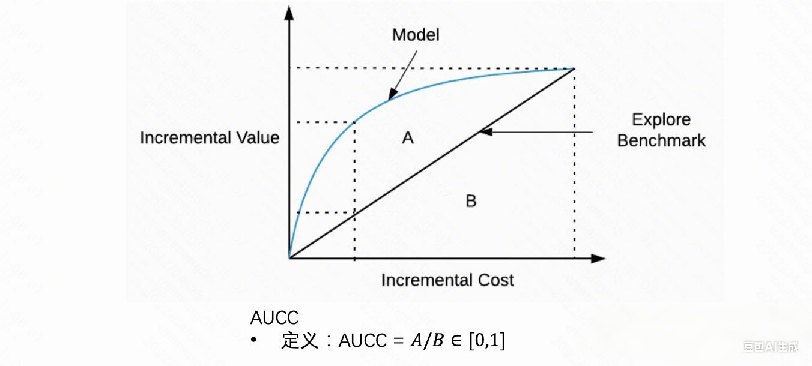

- X－axis：成本增量 $\tau^c, \#\left\{T_i=1 \mid S_i>S_i^{p_{t h}}\right\}$

- Y－axis：收益增量 $\tau^r, A T E\left\{x_i \mid S_i>S_i^{p_{t h}}\right\}$

- 用户按质量排序（ $S_i=f\left(X_i\right)$ ，其中 f 与成本和收益相关）

简单来看，当每个 user 成本是一样的话，AUUC和AUCC是等价的，图中斜率都能代表 ROI
这里的核心是计算用户质量分，不但要考虑收益增量还要考虑成本增量（与评估指标一致），业务目标简单可以表达为 $\max \sum_{i=1}^n \tau^r\left(x_i\right) z_i \quad$ s．t．$\sum_{i=1}^n \tau^c\left(x_i\right) z_i \leq B, z_i \in\{0,1\}$ ，根据 fractional knapsack（Dantzig．1957）简单可以使用贪心 $S_i=\frac{\hat{\tau}^r\left(x_i\right)}{\hat{\tau}^c\left(x_i\right)}$ 进行求解。但是比值可能会放大误差，且无法区分比值为负时我们需求 $\left(\tau^r>0, \tau^c<0\right)$ ，且还需要估计 2 个模型

一个简单的优化，可以参考拉格朗日松弛方法，求解大规模分布式分配问题，把成本约束松弛到目标，保留整数约束，进而可以把问题分解成子问题，通过交替迭代对偶问题与原始子问题进行求解，最终可以得到

$$
S_i=\hat{\tau}^r\left(x_i\right)-\lambda \hat{\tau}^c\left(x_i\right)=E\left[\left(Y^r(1)-\lambda Y^c(1)\right)-\left(Y^r(0)-\lambda Y^c(0)\right) \mid X=x\right]
$$

，进而可以直接建模最终目标 $Y^s=Y^r-\lambda Y^c$ ，解决比值问题和预估多个模型带来的问题。

## EOM


# 校准


在Uplift模型中，值准是指对个体干预效果（ITE）预估数值的准确性，序准则是指对个体干预效果排序的准确性


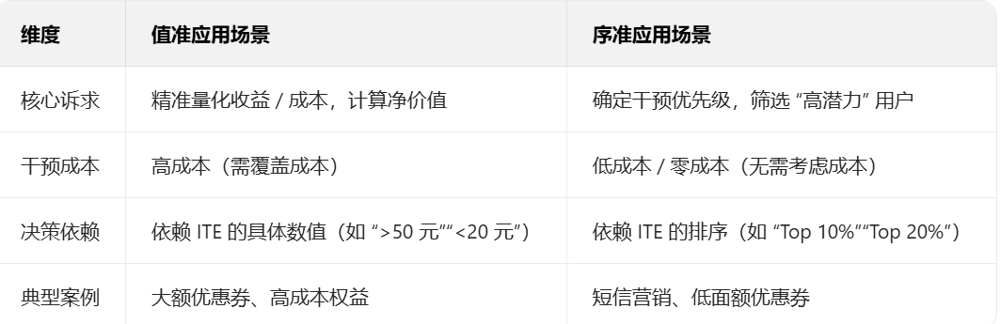

## 序准


***序准***：常见评估指标有 AUUC（Area Under the Uplift Curve）、Qini 系数等。

- AUUC 反映的是 Uplift 模型对个体干预效果的排序能力。它基于预估的 uplift 从大到小排序后，计算不同 top - K 子集下 treatment 组和 control 组的转化数差异，曲线下面积越大，说明排序越准。

- Qini 系数是对 AUUC 的改进，能处理 treatment 组和 control 组样本数量差异大的情况，更具稳定性。两者都是根据 Uplift Score 排序，衡量所有样本 Uplift Score 的序准，但实际应用中可能因未考虑成本等因素存在局限性。

## 值准

在 Uplift 模型的实际落地中，值准（对个体干预效果 ITE 预估数值的准确性） 的核心价值在于：当业务需要精准量化 “干预动作的实际收益 / 成本”，或依赖 “具体收益数值” 做决策时，值准会成为关键评估维度。其应用场景的核心逻辑是 —— 不仅要知道 “谁更值得干预”（序准解决的问题），更要知道 “干预这个人能带来多少具体价值”，从而优化资源分配效率、控制成本或最大化 ROI（投资回报率）。

***值准***:通常用 PEHE（Precision in Estimation of Heterogeneous Effect）来评估，但实际场景中往往难以获取真实的 ITE。因此，可将数据以预估 lift 排序后分桶，把桶内的 ATE（平均处理效应）和预估的 lift 均值进行对比，进而采用回归任务中的一些指标（如 MSE、R2 - Score 等）来评估值准程度。

典型的应用场景

***1. 精细化资源分配：高成本干预场景（核心诉求：控制成本，避免 “高投入低回报”）***

当干预动作本身存在明确且较高的成本（如现金补贴、高价值实物礼品、专属服务人力成本等）时，仅靠序准（排序 “谁的 uplift 更高”）无法判断 “干预此人的收益是否能覆盖成本”，必须依赖值准（精准预估 “干预能带来的净收益”）。

典型场景：电商平台的大额满减券（如满 200 减 50）、外卖平台的高面额红包（如满 30 减 15）、金融机构的高成本权益（如高端信用卡的机场贵宾厅服务、专属理财顾问）。

决策逻辑：
假设某电商平台的大额券成本为 50 元 / 张，通过 Uplift 模型预估用户 A 的 “干预后增量消费收益” 为 80 元（ITE=80），用户 B 的 ITE 为 40 元。
若仅看序准，A 的排序高于 B，但若不看值准，给 B 发券会导致 “收益 40 元 < 成本 50 元”，净亏损 10 元；
依赖值准可筛选出 “ITE> 干预成本” 的用户（如仅给 A 发券），确保每一笔干预都能产生正净收益，避免资源浪费。

***2. 收益目标驱动的分层运营：明确 “干预力度与收益匹配”（核心诉求：按收益定策略，最大化总收益）***

当业务需要针对不同用户群体制定差异化的干预力度（如不同面额的优惠券、不同频次的营销触达），且干预力度与 “预估收益” 强相关时，值准是分层的核心依据 —— 只有精准预估 ITE，才能确定 “给某类用户多大力度的干预最合适”。

典型场景：在线教育的课程折扣分层（如对 “预估增量报名收益高” 的用户给 9 折，对 “收益中等” 的用户给 9.5 折）、运营商的流量包推送（如对 “预估增量消费 50 元” 的用户推 10 元 10GB 包，对 “预估增量 20 元” 的用户推 5 元 5GB 包）。

决策逻辑：
若值准低（如实际 ITE 为 50 元的用户被预估为 20 元），可能导致 “高收益用户被给了低力度干预”（本该推 10 元包却推 5 元包，损失潜在增量），或 “低收益用户被给了高力度干预”（推 10 元包却仅带来 20 元增量，成本占比过高）；
只有值准高，才能让 “干预力度” 与 “实际收益” 精准匹配，实现 “每一分干预成本都花在能带来对应收益的地方”，最终提升总收益。

***3. 干预效果的 ROI 核算：业务复盘与模型迭代（核心诉求：验证干预是否真的盈利，优化模型）***

当业务需要量化评估 Uplift 模型驱动的干预活动整体 ROI（如 “这次营销活动花了 100 万，带来了多少增量收益？”），或通过 ROI 反推模型是否需要迭代时，值准是 ROI 计算的基础 —— 只有准确预估 ITE，才能提前测算 “预期 ROI”，并在活动后对比 “实际 ROI 与预期 ROI 的差异”，判断模型是否有效。

典型场景：零售企业的线下门店促销活动（如针对 “预估增量购买额高” 的会员发放到店满减券，活动后核算 “总增量销售额 - 总券成本” 是否达标）、互联网产品的新功能灰度测试（如对 “预估增量活跃时长高” 的用户开放新功能，测算 “增量活跃带来的广告收益 - 功能开发 / 维护成本”）。

决策逻辑：
若值准低（如预期总 ITE 为 200 万，实际仅 100 万），会导致 “预期 ROI=2:1” 的活动实际 ROI 仅 1:1，甚至亏损；
通过值准评估（如对比 “预估 ITE 分桶的均值” 与 “实际 ATE 分桶的均值”，用 MSE/R² 衡量差异），可及时发现模型预估偏差，进而优化特征或模型结构，提升后续活动的 ROI 准确性。


***4. 风险控制类干预：避免 “干预收益无法覆盖风险成本”（核心诉求：平衡收益与风险）***
在部分场景中，干预不仅有 “正向收益”，还可能伴随潜在风险成本（如金融信贷的 “用户逾期风险”、电商的 “用户退货风险”），此时需要通过值准计算 “净干预价值 = 预估 ITE - 预估风险成本”，仅对 “净价值为正” 的用户进行干预。

典型场景：消费金融的授信额度调整（如对 “预估增量还款收益 100 元、预估逾期成本 30 元” 的用户提额，对 “预估收益 50 元、逾期成本 60 元” 的用户不提额）、电商的高客单价商品推荐（如对 “预估增量购买收益 200 元、预估退货成本 50 元” 的用户推荐，对 “收益 100 元、退货成本 80 元” 的用户不推荐）。
决策逻辑：
若值准低（如实际逾期成本 60 元的用户被预估为 30 元），可能导致 “净价值为负的用户被干预”（如给逾期风险高的用户提额，最终损失大于收益）；
只有值准高，才能精准计算 “净干预价值”，在 “收益” 与 “风险” 之间找到平衡点，避免因预估偏差导致的风险损失。

# 预算分配

## 离线预算分类

## 实时预算分配


https://gaowenxin95.github.io/learn_uplift_model/le_uplift.html


